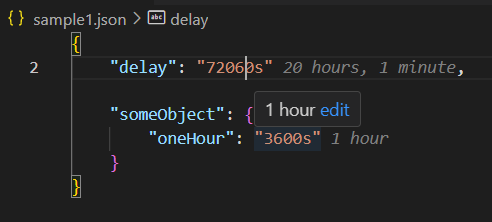

# Protobuf Duration value viewing and editing in JSON

The [Google Protobuf Duration](https://googleapis.dev/nodejs/storagetransfer/latest/google.protobuf.Duration.html) message value gets serialized to JSON as a string showing number of seconds.
This is not readable, nor editable.

This extension shows a _decoration_ next to the `"123s"` value and will provide
a user friendly way of editing the value in days/hours/minutes/seconds.

## Debugging the extension

* `npm install` to initialize the project
* `npm run watch` to start the compiler in watch mode
* open this folder in VS Code and press `F5`
* this will open the `[Extension Development Host]` window, running the extension:
  * Open the `sample1.json` in the editor
